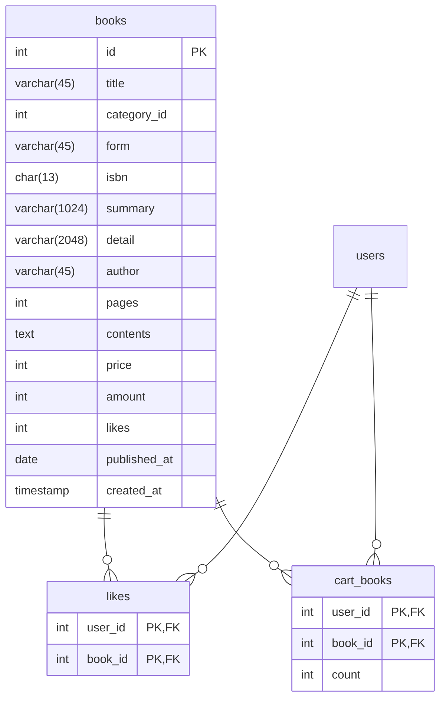
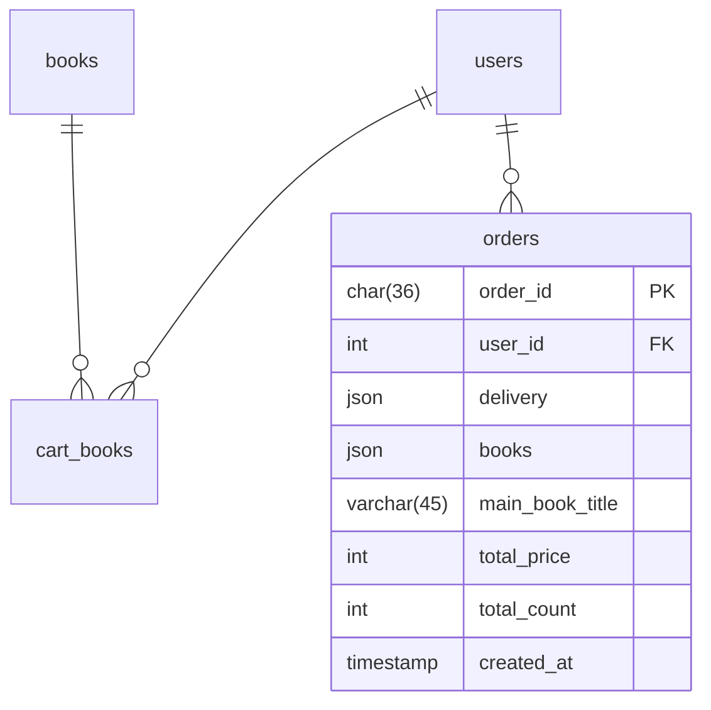
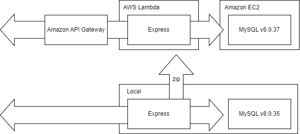

# 온라인 서점 API

- [온라인 서점 API](#온라인-서점-api)
  - [기능 극복 사례 (링크)](#기능-극복-사례-링크)
  - [도메인 설계](#도메인-설계)
    - [도서 도메인 ERD](#도서-도메인-erd)
    - [주문 도메인 ERD](#주문-도메인-erd)
    - [프로모션 도메인 ERD](#프로모션-도메인-erd)
    - [회원 도메인 ERD](#회원-도메인-erd)
  - [시스템 설계도](#시스템-설계도)
  - [API 명세 (링크)](#api-명세-링크)
  - [실행 방법 (링크)](#실행-방법-링크)

 

## [기능 극복 사례 (링크)](https://github.com/kimdev0206/project-2/wiki/%EA%B8%B0%EB%8A%A5-%EA%B7%B9%EB%B3%B5-%EC%82%AC%EB%A1%80)

링크를 확인해주세요. wiki 로 이동합니다.

## 도메인 설계

- 테이블을 리소스 식별에 적합한 도메인으로 분류하였습니다. 공개된 테이블은 해당 도메인에 분류된 항목을 의미합니다.

- 복합키는 중복도가 낮을 순서로 설정하였습니다.

### 도서 도메인 ERD

### 주문 도메인 ERD

### 프로모션 도메인 ERD

### 회원 도메인 ERD

## 시스템 설계도

 

## [API 명세 (링크)](https://documenter.getpostman.com/view/31843867/2s9Ykt5zMy)

도메인에 따라 API 를 분류하였습니다.

링크를 확인해주세요. postman docs 로 이동합니다.

## [실행 방법 (링크)](https://github.com/kimdev0206/project-2/wiki/%EC%8B%A4%ED%96%89-%EB%B0%A9%EB%B2%95)

링크를 확인해주세요. wiki 로 이동합니다.
